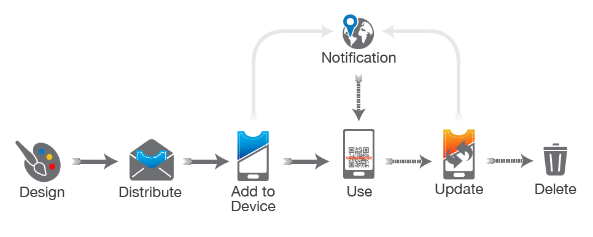

# Documentation: Creating Apple Wallet Pass and Google Wallet Pass
This documentation provides step-by-step instructions for backend developers on how to create Apple Wallet passes and Google Wallet passes. The process involves creating and configuring pass files, generating required certificates, and implementing backend logic to serve the passes.



### Apple Wallet Pass
**Prerequisites**
1. Apple Developer Account: Ensure you have an active Apple Developer account.
2. Certificates: Obtain and configure the required certificates from the Apple Developer portal.

**Step-by-Step Guide**
1. **Create Pass Type ID and Certificates**
    * **Create Pass Type ID:**
      * Navigate to the Apple Developer portal.
      * Go to Certificates, Identifiers & Profiles.
      * Select Identifiers and click the plus button to create a new Pass Type ID.
        
    * **Create and Download Certificates:**
      * Go to Certificates.
      * Click the plus button to create a new certificate.
      * Select "Pass Type ID Certificate" and follow the instructions to generate a Certificate Signing Request (CSR) from Keychain Access.
      * Upload the CSR and download the generated certificate.
      * Install the certificate on your machine and export it as a .p12 file along with the private key.
2. **Create the Pass Structure**
    * **pass.json:**
      * Create a JSON file named pass.json with the structure of your pass, including fields like description, formatVersion, organizationName, passTypeIdentifier, serialNumber, teamIdentifier, barcode, etc.
    * **images:**
      * Add images (logo, background, icon) required for the pass.
3. **Bundle and Serve the Pass**
    * **Create .pkpass File:**
      * Bundle the pass.json, images into a .pkpass file (a zip archive with a .pkpass extension).
    * **Serve the Pass:**
      * Implement a backend endpoint to serve the .pkpass file. Ensure the correct MIME type (application/vnd.apple.pkpass) is set in the response headers.

**Example**
```json
{
  "description": "Example Pass",
  "formatVersion": 1,
  "organizationName": "Your Organization",
  "passTypeIdentifier": "pass.com.yourorganization.pass",
  "serialNumber": "123456789",
  "teamIdentifier": "YOUR_TEAM_ID",
  "barcode": {
    "message": "123456789",
    "format": "PKBarcodeFormatQR",
    "messageEncoding": "iso-8859-1"
  },
  "backgroundColor": "rgb(255,255,255)",
  "logoText": "Example Pass",
  "relevantDate": "2023-06-27T00:00:00Z"
}
```

### Google Wallet Pass
**Prerequisites**
1. Google Cloud Platform Account: Ensure you have an active GCP account.
2. Google Wallet API: Enable the Google Wallet API.

**Step-by-Step Guide**
1. **Set Up Google Cloud Project**
   - **Create a Project:**
      - Go to the Google Cloud Console.
      - Create a new project or select an existing project.
   - **Enable Google Wallet API:**
      - Navigate to the API & Services dashboard.
      - Enable the Google Wallet API for your project.
   - **Create Service Account:**
      - Go to IAM & Admin -> Service Accounts.
      - Create a new service account and download the JSON key file.
2. **Configure Google Wallet API**
   - **Create and Configure Pass Classes**:
      - Use the Google Wallet API to create pass classes and objects.
      - Refer to the [Google Wallet API documentation](https://developers.google.com/wallet/tickets/overview) for detailed steps.
3. **Implement Backend Logic**
   - **Generate Passes**:
      - Use the Google Wallet API to generate passes. Make authenticated requests using the service account key.
   - **Distribute Passes**:
      - Serve the generated passes through your backend.

### References
- [Apple Wallet Pass Official Documentation](https://developer.apple.com/documentation/walletpasses)
- [Google Wallet API Documentation](https://developers.google.com/wallet)
